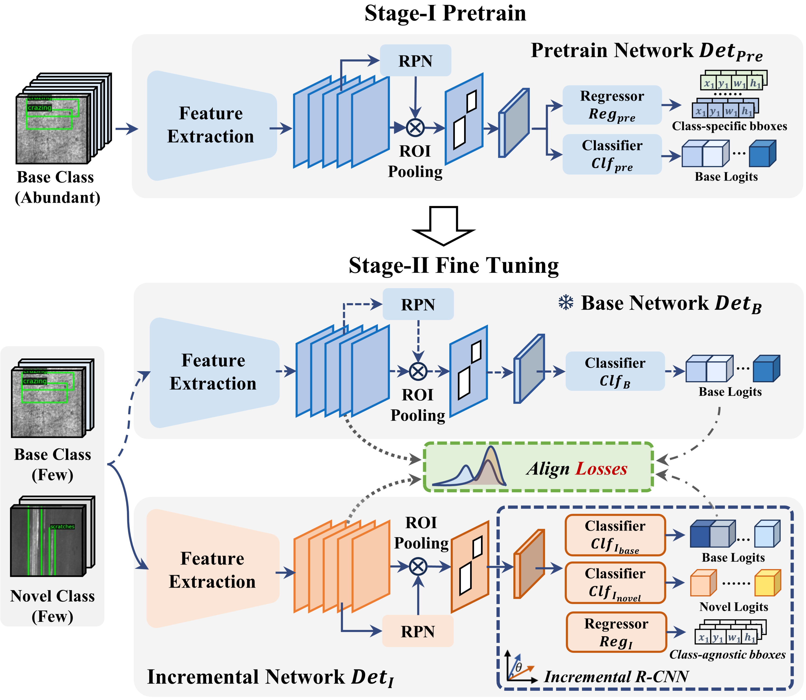
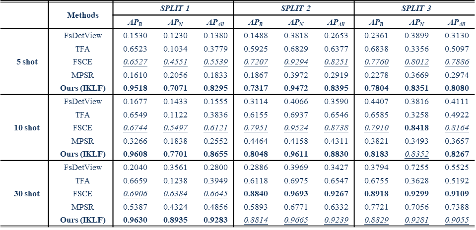
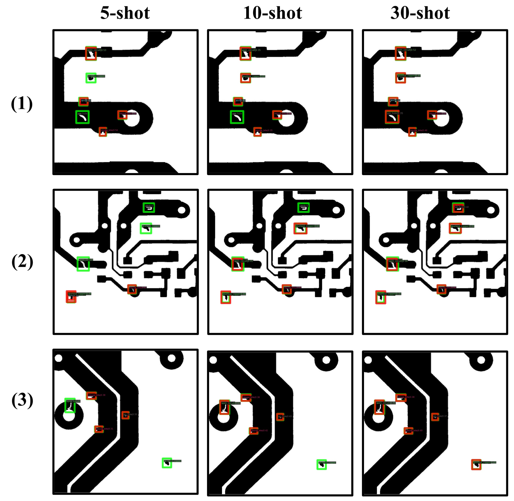

## An Incremental Knowledge Learning Framework for Continuous Defect Detection

This is the Pytorch implementation of our paper:

[IEEE TIM] [**An Incremental Knowledge Learning Framework for Continuous Defect Detection**](https://ieeexplore.ieee.org/document/10363216)

[Chen Sun](https://www.researchgate.net/profile/Chen-Sun-58), [Liang Gao](https://scholar.google.com/citations?user=NqIi8_8AAAAJ&hl=zh-CN), [Xinyu Li](https://www.researchgate.net/profile/Xinyu-Li-35?_sg=HniCSh_9wETKrPDKowJTPZaQ0aUGSyNJMi7eFJiEjz28mrDoxMPCY8NyGfYH1ds2e7b_6O65-Ng0OjZMX-dOlz45r1KcD0tL), [Pai Zheng](https://scholar.google.com.hk/citations?user=gS7pL68AAAAJ&hl=en) and [Yiping Gao](https://www.researchgate.net/profile/Yiping-Gao?_sg=aWBg1PwHU21eb8tNH77N9_9eTPrCGiPdGQKS6saBwmoGk5BzLNteS0VLyLjjUVRLtowxSXVWylwWBNe4jOZtMt72s3WdeS-z) 




### Abstract

Defect detection is one of the most essential processes for industrial quality inspection. However, in Continuous Defect Detection (CDD), where defect categories and samples continually increase, the challenge of incremental few-shot defect detection remains unexplored. Current defect detection models fail to generalize to novel categories and suffer from catastrophic forgetting. To address these problems, this paper proposes an Incremental Knowledge Learning Framework (IKLF) for continuous defect detection. The proposed framework follows the pretrain-finetuning paradigm. To realize end-to-end fine-tuning for novel categories, an Incremental RCNN module is proposed to calculate cosine-similarity features of defects and decouple class-wise representations. What’s more, two incremental knowledge align losses are proposed to deal with catastrophic problems. The Feature Knowledge Align (FKA) loss is designed for class-agnostic feature maps, while the Logit Knowledge Align (LKA) loss is proposed for class-specific output logits. The combination of two align losses mitigates the catastrophic forgetting problem effectively. Experiments have been conducted on two real-world industrial inspection datasets (NEU-DET and DeepPCB). Results show that IKLF outperforms other methods on various incremental few-shot scenes, which proves the effectiveness of the proposed method.

---

### 1. Installation
Here are commands to build a new conda environment and install some necessary packages
```
conda create -n env python==3.8
conda activate env
pip install torch==1.9.0+cu111 torchvision==0.10.0+cu111 torchaudio==0.9.0 -f https://download.pytorch.org/whl/torch_stable.html
pip install mmcv-full==1.4.0 -f https://download.openmmlab.com/mmcv/dist/cu111/torch1.9.0/index.html
pip install mmdet==2.20.0 mmfewshot===0.1.0 mmrazor==0.1.0 mmcls==0.16.0 yapf==0.40.1 tensorboard future
```

### 2. Data Preparation

* We use random seed 1~10 to generate the few-shot split label. They can be found in  `./dataset/fewshot-split`. 

    You can also use `prepare_neu-det_voc_fewshot.py` to generate your own few-shot split.

* Download images from the following links:
[[NEU_DET]](https://www.kaggle.com/datasets/kaustubhdikshit/neu-surface-defect-database) 
[[DeepPCB]](https://github.com/tangsanli5201/DeepPCB)

* Organize the `dataset` folder as following:

```
dataset
    └──NEU_DET
    |   ├── annotations
    |   |   ├── fewshot-split
    |   |   ├── test.json
    |   |   └── trainval.json
    |   └── images  
    └──DeepPCB
        |   ├── fewshot-split
        |   ├── test.json
        |   └── trainval.json
        └── images  
```
### 3. Training
#### 3.1 Pretrain
```
python ./train.py \
    ./config/base_train/frcn_r50_base_training.py \
    --work-dir ./work_dir \
    --gpu-ids 0 \
    --defect DeepPCB \
    --fs_setting Pretrain_SPLIT1
```
#### 3.2 Prepare Weights for Fine-tuning
```
python ./utils/initialize_bbox_head.py \
    --src1 ./path/to/the/checkpoint \
    --save-dir ./path/to/save/dir \
    --method random_init \
    --tar-name finetune_weights
```
#### 3.3 Single-GPU Fine-tuning
```
python ./train.py \
    ./config/fine_tune/iklf_fine_tuning.py \
    --work-dir ./work_dir \
    --gpu-ids 0 \
    --defect DeepPCB \
    --fs_setting SPLIT1_SEED1_5SHOT \
    --pretrain_weights ./weights/generated/in/3.2
```
#### Multi-GPU Fine-tuning

```
CUDA_VISIBLE_DEVICES=your-gpu-ids bash ./shell/dist_train.sh \
    ./config/fine_tune/dkan_fine_tuning.py \
    2 \
    --work-dir ./work_dir \
    --defect DeepPCB \
    --fs_setting SPLIT1_SEED1_5SHOT \
    --pretrain_weights ./weights/generated/in/3.2

```
commands are also provided in [train.sh](https://github.com/Chan-Sun/IFSDD/blob/main/shell/train.sh)
### 4. Tools

We provide scripts for result analysis and visualization.
See [post_analysis.py](https://github.com/Chan-Sun/IFSDD/blob/master/utils/post_analysis.py)

For confusion matrix generation, please refer to [mmdetection](https://github.com/open-mmlab/mmdetection/tree/main/tools/analysis_tools)
### 5. Results






### Citation
If you find this project helpful for your research, please consider citing the following BibTeX entry.
```
@ARTICLE{IKLF,
  author={Sun, Chen and Gao, Liang and Li, Xinyu and Zheng, Pai and Gao, Yiping},
  journal={IEEE Transactions on Instrumentation and Measurement}, 
  title={An Incremental Knowledge Learning Framework for Continuous Defect Detection}, 
  year={2023},
  doi={10.1109/TIM.2023.3343768}}

@article{sun2022new,
  title={A new knowledge distillation network for incremental few-shot surface defect detection},
  author={Sun, Chen and Gao, Liang and Li, Xinyu and Gao, Yiping},
  journal={arXiv preprint arXiv:2209.00519},
  year={2022}
}
```
